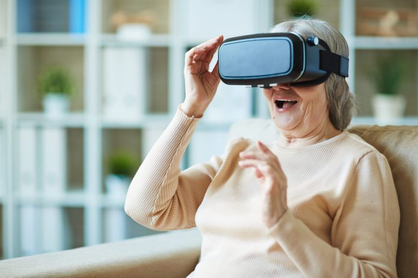

---
# output:
#   html_document:
#     toc: true
#     toc_float: true
#     fig_pos: "H"
---
 

# Do you want to participate in our research?
We are currently looking for participants for a paid study in VR. 

 

### The project
We are looking at how humans predict how objects move in their environment. You will be judging the speed of objects that move across the scene in front of you. You can view short clips from two main tasks [here (on YouTube)](https://youtu.be/AsROlBXzgr0) and [here (on YouTube)](https://youtu.be/c_e3M1xlctU).
 

### Practicalities
- *VR headset required*, must connect to a PC
- 45 CAD compensation for your time, paid as amazon gift card (I know amazon is the devil in-corporate, but ...)
- About 1 hour and 30 minutes in length (including setup, listening to instructions, some breaks etc.)
- [Sign up here (Google Forms)](https://docs.google.com/forms/d/1gdFIRqkvFwp5ZKCGz59RL-8P9uSi0iGVwWjVON9gc10/edit) 

---