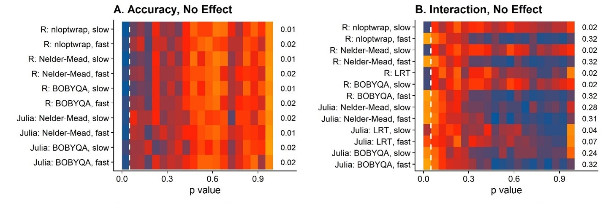
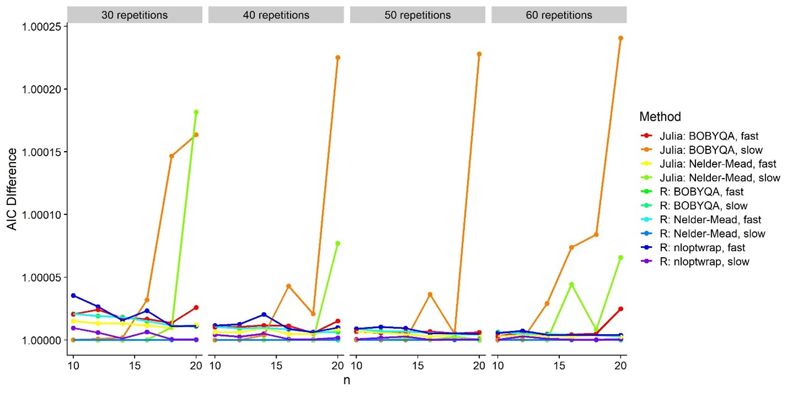

---
# output:
#   html_document:
#     toc: true
#     toc_float: true
#     fig_pos: "H"
---
<br>

# Comparing Julia and R for the fitting of Generalized Linear Mixed Models<br>
<br>

_**TLDR:** Julia is supposed to be faster than R for pretty much everything. I tried out a couple of different optimizers and configurations for some GLMMs and Julia really isn’t that much faster than the best R options. Actually, in my context (power analyses via simulations), Julia doesn’t seem to be better than R at all._<br><br>

I have been working on some power-analyses-through-simulations that require me to fit Generalized Linear Mixed Models. Since I am working with not-small datasets (10000-30000 observations) it takes A WHILE to simulate and analyze the 200+ datasets I want to get a reasonable power estimate. And even more so, if I want to simulate the power for several combinations of number of trials and number of participants. <br><br>
So I started to look into Julia which I understand is marketing itself as a faster alternative to R for statistics. The syntax and all is simple enough if you know some R, so I shed only a moderate amount of tears et al. while translating parts of my R scripts into Julia. The result – that is by no means pretty – can be found [here](https://github.com/b-jorges/Data-Analysis-and-Power-Simulations-GLMM/blob/main/Optimizers%20and%20Approaches.ipynb). Simultaneously, I looked into optimizing the GLMER fitting process with R and found that using the optimizer implementations from the package nloptwrap over the built-in optimizers from the lmer package actually speeded up the process by quite a bit. So I thought I’d pit Julia and these faster R implementations against each other to see just how much of an advantage Julia would provide in terms of fitting durations.<br><br>
I also found that using different optimizers could lead to vastly different p value approximations, so I checked that out systematically, too. I wouldn’t usually use p values with GLMMs, but computing bootstrapped confidence intervals etc. is just not feasible for power analyses that require me to simulate and analyze these huge datasets maybe 2000 times overall. It would take weeks, no matter what language I use. Satterthwaite-approximated p values are, if they work more or less, a good way to evaluate significance in these simulated datasets quickly. For my research (see further below for a little introduction), I need to analyze both main affects and interaction effects, and therefore I also need p values for main effects and interaction affects.<br><br>

## Wait, why are you doing this? – The background
I have been working on an introduction to power analyses via simulations adapted to my area, Vision Science, and more specifically adapted to a group of methods called Psychophysics. Psychophysics studies “the relation between stimulus and sensation”, in other words: How do we perceive stuff? In practice, it means that I’m putting a VR helmet on my participants, show them two balls flying around in a virtual environment and ask them which of the two balls were faster. Lots and lots and lots of times. One of the balls would usually have the same speed all throughout the experiment. Let’s call this one the “comparison” or “reference stimulus”. The speed of the other ball can vary across the experiment. 
Now the thing is that analyzing data from these so called “two-alternative forced-choice tasks” is challenging. Usually, we fit so called “psychometric functions”. They look like this:


<br>

On the x axis you have the difference in stimulus strength between one stimulus and the other. For example, when I simulate the same physical speed for both balls, that would be 0 on the x axis. Then on the y axis, we have the proportion of responses that “the test stimulus was faster”. So the lower the value, the more often participants chose the comparison ball as faster, and the higher the value, the more often participants chose the test ball as faster. These proportions tend to lay on something resembling a Cumulative Gaussian function, which is why we often fit such a function to our data to describe the performance of our participants – as a so called "Psychometric Function". When the curve is very steep (that is, the standard deviation of the cumulative Gaussian is very low), the participant is very good at distinguishing the speed of the balls.And the mean of the Cumulative Gaussian corresponds to the strength of the test stimulus the participant perceives as equivalent to the comparison stimulus. Say, one of the balls is pink and the other purple, we could assess to what extent the color of the balls biases our perception: maybe we have a tendency to perceive pink balls as faster, or the other way around? That would be reflected in the means of these fitted Psychometric Functions.

## Which models did I run?<br>
The exact specifications in terms of fixed and random effects are up for debate, but not really the relevant thing here.<br>

#### In R:
```{r analysis1, results = 'hide', error=FALSE, eval=FALSE}
Model = glmer(cbind(Yes, Total - Yes) ~ 
        ConditionOfInterest*Difference + 
            (ConditionOfInterest+Difference| ID) + 
            (Difference| StandardValues), 
        family = binomial(link = "logit"),
        data = Psychometric,
        nAGQ = 0,
        glmerControl(optimizer = "Nelder_Mead"))
```

We vary this base model by comparing all different optimizers, with `glmerControl(optimizer = "bobyqa")`, `glmerControl(optimizer = "nloptwrap")` and `glmerControl(optimizer = "Nelder_Mead")`, and the nAGQ option which can take the values `nAGQ = 0` and `nAGQ = 1`.<br>
<br>

#### In Julia:
```{r analysis2, results = 'hide', error=FALSE, eval=FALSE}
formula = @formula(Answer ~ Difference*ConditionOfInterest + 
                            (Difference + ConditionOfInterest |ID) + 
                            (Difference|StandardValues));
Model = GeneralizedLinearMixedModel(formula, Psychometric, Binomial())

```
The default optimizer is BOBYQA, and we can use Nelder-Mead instead with this line:
```{r analysis3, results = 'hide', error=FALSE, eval=FALSE}
Model.optsum.optimizer = :LN_NELDERMEAD
```
When fitting the model, we can switch between the `fast=true` and the `fast=slow` conditions, which correspond to `nAGQ = 0` and `nAGQ = 1`, respectively.

```{r analysis4, results = 'hide', error=FALSE, eval=FALSE}
Fit = fit!( Model_Julia_NeldMeader_AGP0, fast=true)
```

<br>

## What did I find out?
I compared different optimizers (Nelder-Mead from lmer, BOBYQA from lmer, BOBYQA from nloptr, Nelder-Mead from the MixedModels.jl package in Julia, BOBYQA from the MixedModels.jl package) and with nAPQ = 0 and nAQP = 1 in R, as well as fast = 0 and fast = 1 in Julia (which are the same underlying changes to the optimization process that I don’t understand, nor aspire to understand – for now). My dependent variables are the fitting duration as well as the false positive rates when a true effect was absent.<br><br>

#### False positives

First the false positive rates because, well, we can’t even consider methods that give us inflated false positive rates:


<br>
This figure shows heatmaps of where these p values fall. A concentration of orange or even red in the left part in the upper two panels is bad, because they indicate that these methods reported back with lots of false positives. The little numbers on the right of each panel indicate the false positive rates. For the main effects (“Accuracy”), everything is fine. For the interaction, however, oh boy. Lots of false positives for, really, most of the optimizers. The good ones are those models I fitted with the `nAQP = 1`/`fast = 0` options, both in R and in Julia. I also used Likelihood Ratio Tests to see what would happen if I compared two bad models (with nAQP = 0 in R), and it turns out that that’s a viable option. But that of course entails fitting two models (one test model and one null model), that is, twice the duration and .. meh. Let’s stick to the good `nAQP = 1` models!
<br><br>

#### Model fits

Is this false positive weirdness due to lacking model fits?


<br>
These are AIC(Model) – AIC(R: Nelder-Mead, slow). So the one with the highest AIC (= worst model fit) is Julia: BOBYQA, slow. But that’s one of the ones that has an alright false positive rate.<br><br>

#### Speed

Let’s see which of the good ones are the fastest:


<br>

Soooo … among the configurations that provide the acceptable false positive rates, the nloptr implementation of the BOBYQA optimizer with nAQP = 1 is the fastest. The likelihood ratio test over two models fitted with nAQP = 0 with nloptr BOBYQA is slightly behind. All Julia implementations are actually *slower* than the nloptr BOBYQA implementation. So Julia really isn’t useful for our purpose (currently). <br><br>

## Conclusions

Main thing: For the fitting of the GLMMs (at least the type of GLMMs I am using), Julia doesn't seem to be more useful than R? *But* that is pretty much bound to change as the Julia ~eco-system~ (ugh I hate this word) grows and maybe faster implementations for these optimizers become available. In fact, maybe there already is ~such thing~? Or if not, maybe someone might be inclined to make ~such thing~? <br>
<br>
But as you may have realized, I'm not a pro-programmer, and much less so for Julia, so maybe I just messed up the code? If anyone wants to check, that would be terrific!
<br>
_Some adjacent things:_ <br>

-	Somehow, and I’m not the right person to ask why, the nAGP/fast settings can make a huge difference in Satterthwaite-approximated p values for interactions. So huge that with nAGP = 0/fast = true, we get way more false positives than we should, but again, only for interactions. Main effects are fine. Does that also translate to more robust ways of assessing significance (e.g. bootstrapped confidence intervals)? I haven't tried, but I guess someone should.<br>
-	Not treated in this post, but: model specifications can make a huge difference for approximated p values, with too few random effects often leading to inflated false positive rates for interactions. Again, main effects are mostly fine. I’m currently working on something where we look at that in a bit more detail.<br>
-	Julia (and MixedModels.jl!) are awesome and I’m happy I learned some! <3 <br>