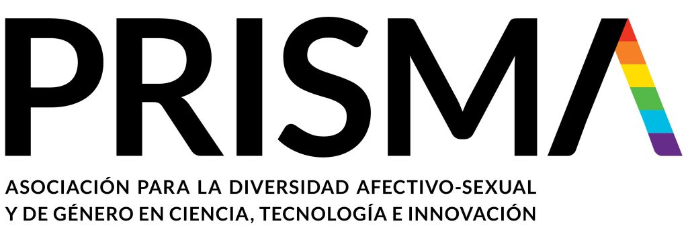

---
---

 

# PRISMA

I am Co-Director for Research and Conferences at PRISMA, the Spanish association for LGBTIQA+ people in Science, Technology and Innovation. Our goals are to make science more diverse, help our members in concrete situations of need and increase the visibility of queer persons in Science, Technology and Innovation. More info on our website: [www.prismaciencia.org](www.prismaciencia.org).

 

---
