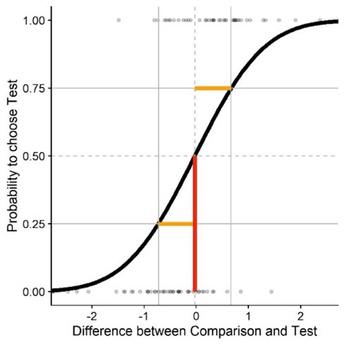

---
# output:
#   html_document:
#     toc: true
#     toc_float: true
#     fig_pos: "H"
---
<br>

# Weird GLMM behavior ...<br>
<br>

I’m stats-y analyzing some psychophysical data per GLMM with a probit link function. You can see a sequence from the experient [here (on YouTube)](https://youtu.be/cchYev56eYU).

The big ball can have one out of two speeds (and one out of two directions), and the speed of the ball cloud is chosen dynamically based on a PEST staircase. While the big ball is moving across the screen, participants experience visual self-motion in the same or opposite direction as the target stimulus or no self-motion at all. They had to judge on each trial whether the big target was faster or the ball cloud.

I was originally using the following formula for the GLMM:
```{r analysis1, results = 'hide', error=FALSE, eval=FALSE}
glmer(Probability ~ SelfmotionProfile * Difference + 
                    (Difference | Participant) + 
                    (Difference | Speed_BigBall), 
        family = binomial(link = "probit"),
        data = Data)
```

Probability is the probability to judge that the big target was faster (put in as binary choices on each trial); SelfmotionProfile is a categorical variable with the values “Static”, “Same Direction”, “Opposite Directions”; Difference is the difference between the velocity of the big target and the velocity of the ball cloud. The fixed effect “SelfmotionProfile” would correspond to how much the self-motion condition impacts the PSE (by shifting the whole function left/right), and the interaction between “SelfmotionProfile” and “Difference” would correspond to how much the self-motion condition impacts the JND (by making the function steeper/less steep).

A picture of how these psychometric functions generally look like (in case a non-psychophysicist statsy person sees this):


<br>


The problem is: the results I get with this model don’t really make sense, and they are also just *fully* inconsistent with my beautiful beautiful plots (which I made by fitting psychometric functions – cummulative Gaussians – and extracting PSEs and JNDs from those).

Now when I use the speed of the ball cloud (which is variably adjusted according to the PEST staircase) as variable in the model instead of the difference between the speed of the ball cloud and the speed of the big target, the results do make sense and are consistent with the plots.

Now my big question: Whyyyyyyyy? By subtracting the speed of the big target, shouldn’t I just be shifting everything to the left and center it around zero (ish)? E.g., the impact of “SelfmotionProfile” on accuracy and precision shouldn’t be affected by that at all?