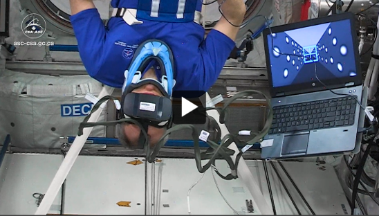

---
# output:
#   html_document:
#     toc: true
#     toc_float: true
#     fig_pos: "H"
---
 

# Current Projects
 

### Self-motion in microgravity

 
 Astronaut David Saint-Jacques while doing our experiment in space. You can watch him [talk about our project here (YouTube)](https://www.youtube.com/watch?v=v8uW3xXy1No&ab_channel=CanadianSpaceAgency) 

My mainstay in Toronto is an awesome SPACE PSYCHOLOGY PROJECT under the lead of Dr. Laurence Harris – one step closer to fully automated luxury gay space communism! –, funded by the Canadian Space Agency. We shoot people into orbit and see how this affects their depth perception and the sense of self-motion generated by visual cues. The main idea is that people should weight visual input more strongly in the absence of gravity. How will everything play out? Tune in in a year or so and we'll let you know!

Here a little [presentation on some preliminary space data](https://www.youtube.com/watch?v=buRjROWz7ds&ab_channel=Bj%C3%B6rnJ%C3%B6rges), and here the same thing but as a [poster](https://twitter.com/b_jorges/status/1298470474742079488).

### Prediction of motion during self-motion

 
 Astronaut David Saint-Jacques while doing our experiment in space. You can watch him [talk about our project here (YouTube)](https://www.youtube.com/watch?v=v8uW3xXy1No&ab_channel=CanadianSpaceAgency) 

 
 A screenshot from our experiment 

So it seems that humans misperceive the velocity of targets in their environment both less accurately and less precisely when they are moving themselves. But do these changes translate to biases in prediction? It's quite likely that, when we observe motion and judge it incorrectly, then our predictions should reflect these misestimations. But let's find out!

We currently establishing whether self-motion really biases perceived target motion. All files are on [GitHub](https://github.com/b-jorges/Motion-Perception-during-Self-Motion), some of them are even sufficiently commented (wow!). For example the [power analyses](https://github.com/b-jorges/Motion-Perception-during-Self-Motion/blob/master/PowerAnalysisMotionEstimation.R), the [analyses of pilot data](https://github.com/b-jorges/Motion-Perception-during-Self-Motion/blob/master/AnalysisPilotData.R) (for an Analysis using General Linear Mixed Models) and a link to the [Unity project](https://github.com/b-jorges/Motion-Perception-during-Self-Motion/blob/master/Download%20of%20Unity%20Project%20(Stimulus%20Presentation).txt) we use to present stimuli. 

You can also check the video walkthrough of [our VSS poster](https://www.youtube.com/watch?v=cySl9CaQmhk&feature=youtu.be&ab_channel=Bj%C3%B6rnJ%C3%B6rges) on some the pilot data (on YouTube).

### Power analyses for psychophysical designs

Sample size planning is hard. We tend to rely on heuristics ("10 participants for a within-participant design, 30 participants per group for a between-participants design"), which is usually fine, butttt ... let's do it in a principled way? I'm working on an R-based guide for conducting power analyses for psychophysical two-alternative forced-choice designs. Everything is available [on GitHub](https://github.com/b-jorges/Data-Analysis-and-Power-Simulations-GLMM), and I am working on a primer in the shape of a ... paper.

### Do humans have an internal model of air drag?

We (kinda) know that humans represent physical information about their environment, e. g. the size of objects they interact with, the gravitational pull on earth, … but is air drag among these physical properties? We think it should be. To be honest, it wouldn’t make much sense if we didn’t … but well, we’re scientists and we need to check!

I am developing this project together with [Borja Aguado](https://osf.io/tj628/) under supervision of Dr. Joan López-Moliner.

### Does earth-gravity conformant motion facilitate motion duration estimation?

It has been shown that earth gravity congruent motion benefitted motion duration estimates for 2D motion in front of a pictorial background. We would expect the same for more naturalistic stimuli (parabolic motion in 3D in a rich environment). And that’s what we’re testing.

I am developing this project together with Dr. Barbara LaScaleia, under supervision of Dr. Myrka Zago.

---