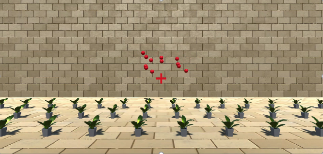

---
# output:
#   html_document:
#     toc: true
#     toc_float: true
#     fig_pos: "H"
---
 

# Finished Projects
 

### Speed estimation during (visual) self-motion

 
 A screenshot from our experiment 

The perception of speed can be biased during the visual perception of self-motion. Check out the details [in the paper](https://link.springer.com/article/10.3758/s13414-021-02372-4).

You can also check out my [Talk at VSS 2021](https://www.youtube.com/watch?v=WH0uq6iocoU&ab_channel=Bj%C3%B6rnJ%C3%B6rges), which is pretty much the final story!
 
 

### Power analyses for psychophysical designs

Sample size planning is hard. We tend to rely on heuristics ("10 participants for a within-participant design, 30 participants per group for a between-participants design"), which is usually fine, butttt ... let's do it in a principled way? I'm working on an R-based guide for conducting power analyses for psychophysical two-alternative forced-choice designs. Everything is available [on GitHub](https://github.com/b-jorges/Data-Analysis-and-Power-Simulations-GLMM), and I have also written this up [as a Preprint](https://psyarxiv.com/ack8u/).
 
 

### Does earth-gravity conformant motion facilitate motion duration estimation?

It has been shown that earth gravity congruent motion benefitted motion duration estimates for 2D motion in front of a pictorial background. We would expect the same for more naturalistic stimuli (parabolic motion in 3D in a rich environment). That is not what we found: rather than for the earth gravity-concordant parabolas, precision was highest for a control condition in which the tangential speed of the ball was kept constant. Have a look [at the paper](https://www.nature.com/articles/s41598-021-86428-3) or listen to [a little presentation I did on the matter](https://www.youtube.com/watch?v=gnFFbNUeLy0&ab_channel=Bj%C3%B6rnJ%C3%B6rges).
 
 

### We track motion more successfully with our eyes when it unfolds according to earth gravity

ONE: An internalized representation of gravity (or [strong gravity prior](https://www.frontiersin.org/articles/10.3389/fnhum.2017.00203/full)) helps us predict motion in our environment
TWO: Eye movements are partially guided by predictions
EQUALS: We should track trajectories more successfully when the object moves according to earth gravity.

And, PLOT TWIST, that's what we found.

[More in the paper (:](https://www.nature.com/articles/s41598-019-50512-6)
 
 

### How precise are we in perceiving visual gravity from parabolic motion? What decision variables do we use?

We're pretty at judging gravity: Weber Fractions between 13% and >30%. The rate of change of the elevation angle seems to play a pretty important role, but also the represented size of the object and the visual angle it occupies.

[More ~ información ~ in the paper.](https://scholar.google.com/citations?view_op=view_citation&hl=es&user=4YxOOiIAAAAJ&citation_for_view=4YxOOiIAAAAJ:u5HHmVD_uO8C)
 
 

### Review on the evidence around an internal representation of gravity

Yeah, uh, what the heading says. Lots of evidence that we represent and use earth gravity to make judgements on time-to-contact and other stuff. We also talk about how it might fit in with a Bayesian framework of perception. [Published as "Gravity as a Strong Prior: Implications for Perception and Action"](https://www.frontiersin.org/articles/10.3389/fnhum.2017.00203/full) in a one of the incredibly prestigious Frontiers journal but whatev's, I still like it!