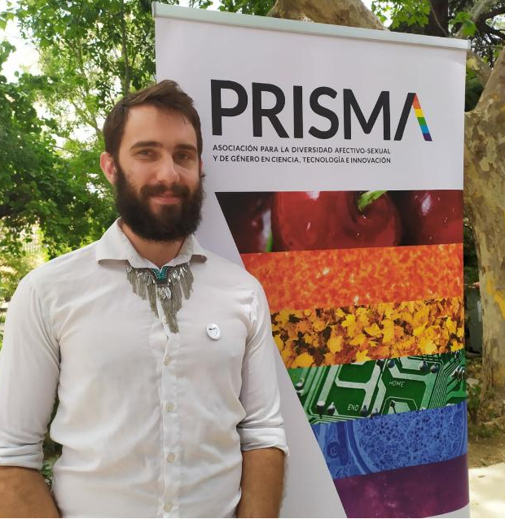

 

# Björn Jörges

<figure_side style="float: left">
<b font_align="center"> Contact: </b>  
&#x2709; e-mail : [Bjoern_joerges@hotmail.de](mailto:Bjoern_joerges@hotmail.de)
   GitHub: [b-jorges](https://github.com/b-jorges)
   OSF: [Bjoern Joerges](https://osf.io/qrtbh/)
   Twitter: [b_jorges](https://osf.io/qrtbh/)
 
 
</float_side>

My name is Björn Jörges, I am currently a PostDoc in the Harris lab at York University, Canada. I study  the visual perception of motion, prediction, self-motion and visuo-vestibular integration.

---